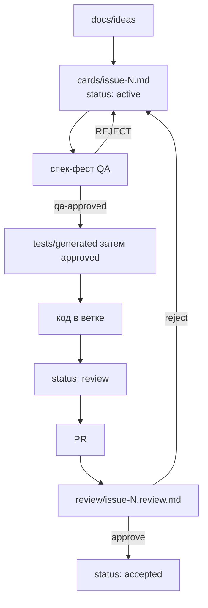

# Организация разработки (SDD)

**Статус:** SoT процесса для людей и агентов в consumer-репо, установленном из **sdd-kit**.

Коротко: [CONTRIBUTING.md](../CONTRIBUTING.md) · [AGENTS.md](../AGENTS.md) · skill `.cursor/skills/sdd-workflow/SKILL.md`.  
Эталоны: [docs/_templates/](_templates/). Tier L: [sdd-tier-epic-feedback.md](./sdd-tier-epic-feedback.md).

## Два слоя документации

| Слой | Где | Трогаем? |
|------|-----|----------|
| Продуктовые спеки | собственные docs продукта | Не режем на карточки задним числом |
| Позадачный SDD | `docs/ideas`, `requirements/cards`, `contracts`, `adr`, `tests/*` | Новые фичи/фиксы только так |

## Карта путей

`{N}` — номер GitHub Issue. `task_slug` = `issue-{N}`.

| Артефакт | Путь | Шаблон |
|----------|------|--------|
| JTBD | `docs/ideas/issue-{N}.md` | [_templates/jtbd.md](_templates/jtbd.md) |
| Epic | `docs/requirements/cards/issue-{E}.md` | [_templates/epic.md](_templates/epic.md) |
| Design / C4 | `docs/design/issue-{E}.md` | [_templates/design-c4.md](_templates/design-c4.md) |
| Карточка + AC | `docs/requirements/cards/issue-{N}.md` | [_templates/card-ac.md](_templates/card-ac.md) |
| Реестр | `docs/requirements/registry.yaml` | — |
| Контракт | `docs/contracts/issue-{N}.md` | [_templates/contract.md](_templates/contract.md) |
| ADR | `docs/adr/{nnn}-issue-{N}.md` | [_templates/adr.md](_templates/adr.md) |
| Тесты generated | `tests/generated/issue-{N}.md` | черновик |
| Тесты approved | `tests/approved/issue-{N}.md` | [_templates/tests-approved.md](_templates/tests-approved.md) |
| Ревью | `docs/requirements/review/issue-{N}.review.md` | [_templates/review.md](_templates/review.md) |
| Finding | `docs/requirements/review/issue-{N}.findings.md` | [_templates/finding.md](_templates/finding.md) |

Статус карточки — frontmatter: `active` → `review` → `accepted` (или `cancelled`).

## Git Flow

1. Ветка `{type}/issue-{N}` от актуального base (обычно `main`).
2. Conventional Commits в заголовке PR.
3. PR обычно в `main`. Draft в `dev` — только по явному Project override; merge — человек.
4. CI kit: `.github/workflows/pr-governance.yml` (заголовок + опционально forbid `dev`).

## Поток

## Установка / обновление kit

См. [README.md](../README.md): `scripts/sdd-init.sh`, `scripts/sdd-sync.sh`.
