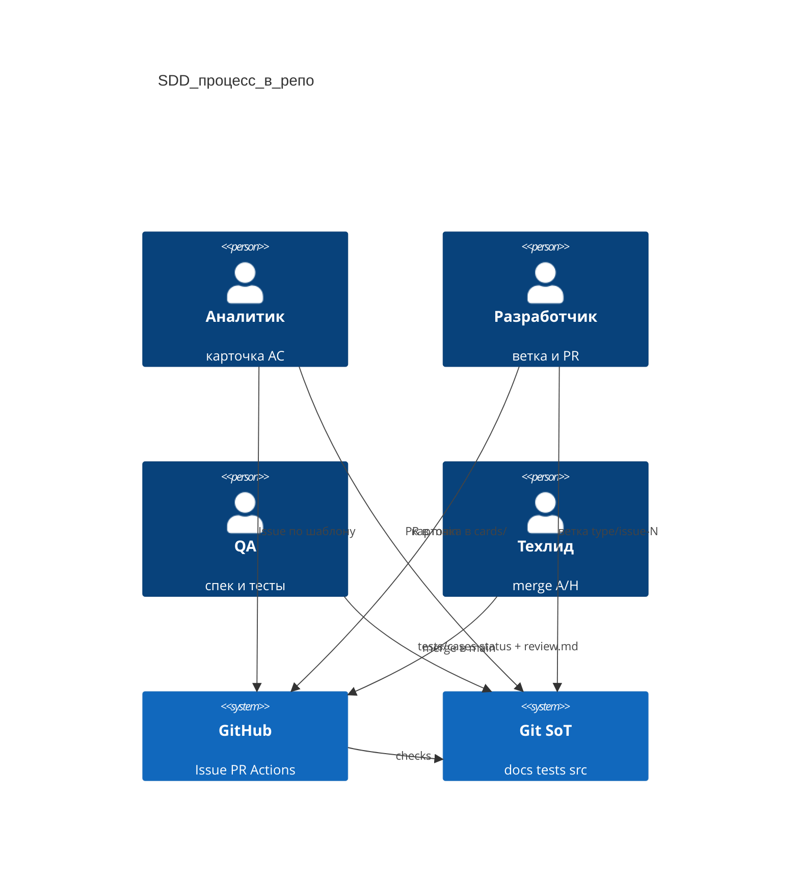
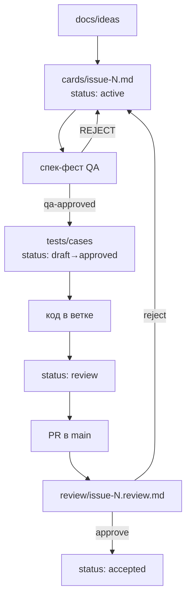

# Организация разработки (SDD)

**Статус:** SoT процесса для людей и агентов — основной документ по организации работы в репозитории.

Короткая выжимка для GitHub: [CONTRIBUTING.md](../CONTRIBUTING.md).  
Инструкции агентам: [AGENTS.md](../AGENTS.md) · скилл `.cursor/skills/sdd-workflow/SKILL.md`.  
Эталоны форм: [docs/_templates/](_templates/).  
Дополнение tier L / feedback: [sdd-tier-epic-feedback.md](./sdd-tier-epic-feedback.md).

**Два слоя документации (не смешивать):**

| Слой | Где | Что это | Трогаем? |
|------|-----|---------|----------|
| Продуктовые спеки | `raci-agents-7d.md`, `architecture-deploy-c4.md`, `plans/`, `design/`, … | Контур продукта, дизайн, дорожные карты | Не режем на карточки задним числом |
| Позадачный SDD | `docs/ideas`, `docs/requirements/cards`, `docs/contracts`, `docs/adr`, `tests/*` | Одна задача = одна карточка + артефакты | Новые фичи и фиксы только так |

---

## Requirement 1 — Правила репозитория видны на GitHub

**User Story:** Как разработчик, я хочу CONTRIBUTING и шаблоны Issue/PR, чтобы открывать задачу и PR уже в формате SDD, а не пустым текстом.

### Acceptance Criteria

1. WHEN открывается Issue THEN GitHub SHALL предложить типы: идея (JTBD), фича (карточка+AC), баг, ADR.
2. WHEN открывается Pull Request THEN шаблон SHALL требовать ссылку на карточку, чек-лист AC и запрет менять тест-кейс со `status: approved` без смены спеки.
3. WHEN человек заходит в репозиторий THEN README SHALL ссылаться на CONTRIBUTING и карту артефактов.
4. WHEN создаётся PR THEN GitHub SHALL показать ссылку на CONTRIBUTING (файл в корне).

## Requirement 2 — Каркас артефактов SDD в Git

**User Story:** Как аналитик/QA/dev, я хочу папки и markdown-шаблоны артефактов в репо, чтобы карточка, контракт, ADR, тесты и review.md жили в Git, а не только в Issue.

### Acceptance Criteria

1. WHEN клонируется репо THEN SHALL существовать `docs/ideas`, `docs/requirements/cards`, `docs/requirements/review`, `docs/contracts`, `docs/adr`, `tests/cases` (README); `tests/generated` и `tests/approved` MAY оставаться как deprecated указатели / compat.
2. WHEN копируется шаблон THEN структура SHALL совпадать с эталонами (frontmatter + `status` + User Story + WHEN/THEN/SHALL).
3. WHEN читается процесс THEN SHALL быть ясно: продуктовые спеки — отдельно; позадачные карточки — в `docs/requirements/cards/`.
4. IF меняется тест-кейс со `status: approved` THEN это SHALL быть только вместе со сменой карточки/контракта.
5. WHEN меняется статус карточки или тест-кейса THEN SHALL обновляться поле `status` во frontmatter (путь файла стабилен; без `git mv` ради статуса).

## Requirement 3 — Защищённая ветка + Conventional Commits

**User Story:** Как техлид, я хочу, чтобы запрет на вливание касался любой защищённой ветки, а не имени `dev`, и чтобы в этом репозитории прод-веткой был `main` — он приоритетнее `dev`.

### Acceptance Criteria

1. WHEN создаётся ветка THEN имя SHALL быть `{type}/issue-{N}` (`feat/issue-1`, `fix/issue-3`). `{N}` — номер GitHub Issue.
2. WHEN пишется коммит или заголовок PR THEN формат SHALL быть Conventional Commits (`feat:`, `fix:`, `docs:`, `test:`, `refactor:`, `chore:`, `ci:`).
3. WHEN речь о вливании THEN запрет SHALL относиться к любой защищённой ветке (branch protection), а не к имени `dev`. В этом репозитории прод-ветка SHALL быть `main` и SHALL быть приоритетнее `dev`.
4. WHEN человек merge в защищённую ветку THEN это SHALL быть A/H-гейт (человек), не авто-merge.

## Requirement 4 — Лёгкая автопроверка PR

**User Story:** Как ревьюер, я хочу, чтобы робот сам отклонял PR с кривым заголовком, а имя `dev` само по себе не считал нарушением.

### Acceptance Criteria

1. WHEN открыт/обновлён PR THEN workflow SHALL проверить заголовок как Conventional Commits.
2. WHEN base называется `dev` THEN workflow SHALL NOT падать только из-за этого имени. Вливание в защищённую ветку SHALL оставаться за человеком.
3. IF локальных git-hooks нет THEN разработчик SHALL всё равно пройти проверку на GitHub (без husky).

---

## Дизайн

GitHub — фасад (Issue, PR, Actions). Источник истины по задаче — файлы в Git.





Tier **L** (эпик), обратная связь implementation → design, полный граф с циклами: [sdd-tier-epic-feedback.md](sdd-tier-epic-feedback.md).

### Гейты RACI (первый этап: Design → Deliver)

| Этап | Responsible | Accountable | Человек обязателен? |
|------|-------------|-------------|---------------------|
| Скоуп / «берём в работу» | Product / Analyst | Product | Да (A/H) |
| Карточка + AC | Analyst | QA (спек-фест) | При споре по AC |
| Контракт | Analyst / Architect | Architect | Нет, кроме спорного API |
| ADR | Architect | Architect + техлид | Да (A/H) |
| tests/cases (`status: approved`) | QA | QA | При смене контракта тестов |
| Код | Dev | техлид (merge) | Merge в `main` — A/H |
| review.md | QA | техлид | Merge — A/H |

Человек **обязан** быть в кадре: утверждение скоупа, merge в `main`, эскалация после лимита циклов правки (по умолчанию 3), спор «так ли вообще надо».

---

## Карта путей

`{N}` — номер GitHub Issue. `task_slug` = `issue-{N}` (Issue #3 → `issue-3`). Словесные slug не используем.

| Артефакт | Путь | Шаблон | Кто пишет |
|----------|------|--------|-----------|
| JTBD / боль | `docs/ideas/issue-{N}.md` | [_templates/jtbd.md](_templates/jtbd.md) | Product / Analyst |
| Epic (tier L) | `docs/requirements/cards/issue-{E}.md` | [_templates/epic.md](_templates/epic.md) | Product / Architect |
| Design / C4 | `docs/design/issue-{E}.md` | [_templates/design-c4.md](_templates/design-c4.md) | Architect |
| Карточка + AC | `docs/requirements/cards/issue-{N}.md` | [_templates/card-ac.md](_templates/card-ac.md) | Analyst → Dev |
| Реестр (проекция) | `docs/requirements/registry.yaml` | — | Analyst / CI |
| Контракт | `docs/contracts/issue-{N}.md` | [_templates/contract.md](_templates/contract.md) | Analyst / Architect |
| ADR | `docs/adr/{nnn}-issue-{N}.md` | [_templates/adr.md](_templates/adr.md) | Architect / Dev |
| Тест-кейс | `tests/cases/issue-{N}.md` | [_templates/tests-case.md](_templates/tests-case.md) | Dev пишет (`draft`); QA → `approved` |
| Отчёт ревью | `docs/requirements/review/issue-{N}.review.md` | [_templates/review.md](_templates/review.md) | QA |
| Finding (L2/L3) | `docs/requirements/review/issue-{N}.findings.md` | [_templates/finding.md](_templates/finding.md) | Dev / Architect |

Tier L + обратная связь: [sdd-tier-epic-feedback.md](sdd-tier-epic-feedback.md).

Статус карточки — **frontmatter** (путь стабилен):

1. `status: active` — в работе или после `changes_requested`.
2. `status: review` — спек-фест / код-ревью; рядом `review/issue-{N}.review.md`.
3. `status: accepted` — вердикт `approve`.
4. `status: cancelled` — сняли со скоупа.

Статус тест-кейса (`tests/cases/issue-{N}.md`) — тоже **frontmatter** (путь стабилен):

1. `status: draft` — черновик Dev / генератор.
2. `status: review` — тест-фест / сверка с AC.
3. `status: approved` — замороженный контракт (менять только вместе со спекой).
4. `status: cancelled` — снято.

Папки `tests/generated/` и `tests/approved/` — deprecated; опциональная publish-проекция в `tests/approved/` — один релиз (`scripts/publish-approved-projection.sh`).

Опционально синхронизировать [`registry.yaml`](requirements/registry.yaml). При конфликте побеждает frontmatter карточки.

Frontmatter: `task_slug: issue-3` = суффикс ветки `feat/issue-3`.

---

## Git Flow

Защищённая ветка — любая ветка с branch protection. Это не синоним имени `dev`.

В этом репозитории прод — `main`. Она приоритетнее `dev`. Ветка задачи и PR идут в `main`. Прямой push и авто-merge в `main` не делает агент: вливает человек (A/H). `dev` не подменяет прод и не является отдельным запретным именем из SDD.

Запрещено:

- прямой push и авто-merge в защищённую ветку (здесь это прежде всего `main`);
- придумывать slug вроде `mt5-gap-finder` вместо `issue-{N}`;
- менять статус карточки через `git mv` между папками.

Разрешено:

- сначала GitHub Issue (получаем `{N}`), затем ветка `{type}/issue-{N}` от `main`;
- PR в `main`;
- merge в защищённую ветку — человек (A/H).

Типы веток и коммитов (Conventional Commits):

| type | Когда |
|------|--------|
| `feat` | новая возможность |
| `fix` | исправление бага |
| `docs` | только документация / карточки |
| `test` | только тесты |
| `refactor` | без смены поведения |
| `chore` | сборка, зависимости, каркас |
| `ci` | GitHub Actions |

Примеры:

```text
feat/issue-1
fix/issue-3
docs/issue-12

feat(factory): Gap Finder заполняет пропуски баров
fix(orchestrator): healthz отдаёт service tag
docs: карточка issue-3 status active
```

Заголовок PR проверяет workflow `.github/workflows/pr-governance.yml`. Локальных husky-хуков нет: проверка на GitHub.

---

## Чеклист задачи (от идеи до merge)

1. GitHub Issue по шаблону (JTBD / фича / баг / ADR) — так появляется `{N}`.
2. Карточка в `docs/requirements/cards/issue-{N}.md` (`status: active`) с User Story и AC в формате WHEN/THEN/SHALL.
3. При необходимости: контракт `docs/contracts/issue-{N}.md` и/или ADR, ссылки во frontmatter.
4. Спек-фест: QA смотрит полноту AC (happy path, ошибки, границы). Не ок → правка карточки.
5. Тест-кейс в `tests/cases/issue-{N}.md` (`status: draft`); QA утверждает сменой на `status: approved` **без** `git mv` (менять `approved` только вместе со спекой).
6. Ветка `{type}/issue-{N}`, код, прогон тестов/smoke.
7. В карточке `status: review` (файл не переносим); обновить `registry.yaml` по желанию.
8. PR в `main` (прод; приоритетнее `dev`), заголовок Conventional Commits, заполненный шаблон PR, ссылка на Issue #{N}.
9. Ревьюер пишет `issue-{N}.review.md` (`approve` / `changes_requested` / `blocked`).
10. `approve` → `status: accepted`; `changes_requested` → `status: active`.
11. Merge в `main` — человек.

---

## Настройки репозитория на GitHub (не файлы git)

После появления workflow:

1. Default branch = `main`. Это прод, он приоритетнее `dev`.
2. Branch protection на `main`: required review + required check `pr-governance`.
3. Прямой push в `main` выключен.

---

## Связанные файлы

- [sdd-tier-epic-feedback.md](sdd-tier-epic-feedback.md) — tier S/M/L, обратная связь, граф артефактов
- [AGENTS.md](../AGENTS.md) — вход для агентов
- [CONTRIBUTING.md](../CONTRIBUTING.md)
- [README.md](../README.md) — как подтянуть кит
- Шаблоны GitHub: при init попадают в `.github/`
- Обновление: `scripts/sdd-sync.sh` из репозитория [Noumen-dev/sdd-kit](https://github.com/Noumen-dev/sdd-kit)
