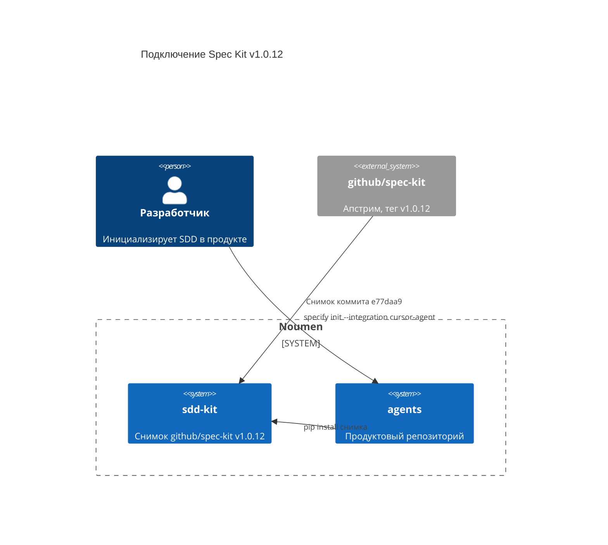

# Пин Spec Kit для Noumen

## Требования

**User Story:** Как разработчик Noumen, я хочу держать в `sdd-kit` сам GitHub Spec Kit зафиксированной последней версии, чтобы продукт подключал кит из нашего репозитория, а не с плавающего апстрима.

### Acceptance Criteria

1. WHEN репозиторий `sdd-kit` собран из этого снимка THEN `pyproject.toml` SHALL объявлять пакет `specify-cli` версии `1.0.12`
2. WHEN установлен CLI из этого снимка THEN команда `specify version` SHALL сообщить `1.0.12`
3. WHEN продукт инициализирует кит THEN интеграция SHALL быть `cursor-agent`, а навыки SHALL появиться в `.cursor/skills/` с префиксом `speckit-`

## Дизайн

Кит хранится целиком в `sdd-kit`. Репозиторий продукта не форкает исходники CLI: он ставит пакет из снимка и запускает `specify init`.



## Подзадачи

- [x] Положить дерево Spec Kit `v1.0.12` в `sdd-kit`
- [x] Зафиксировать тег и коммит апстрима
- [ ] Подтянуть кит в репозиторий продукта командой `specify init`

Этот репозиторий содержит сам GitHub Spec Kit, снимок релиза **v1.0.12**.

| Поле | Значение |
|------|----------|
| Источник | https://github.com/github/spec-kit |
| Тег | `v1.0.12` |
| Коммит | `e77daa9021d20db26b878f7dfa5640fe5a42d04e` |
| Пакет | `specify-cli` `1.0.12` |
| Лицензия | MIT (`LICENSE`) |

Код, шаблоны и документация кита остаются как в апстриме. Этот файл — только метка версии для Noumen.

## Как подтянуть в репозиторий продукта

Из корня репозитория продукта (например `agents`), с CLI, установленным из этого снимка:

```bash
python3 -m venv .venv
. .venv/bin/activate
pip install /path/to/sdd-kit
specify init --here --force --non-interactive --integration cursor-agent --script sh
specify version
```

Интеграция Cursor кладёт навыки в `.cursor/skills/speckit-*` и общую инфраструктуру в `.specify/`. Существующий процесс Noumen (`docs/SDD_WORKFLOW.md`) при этом не заменяется.
