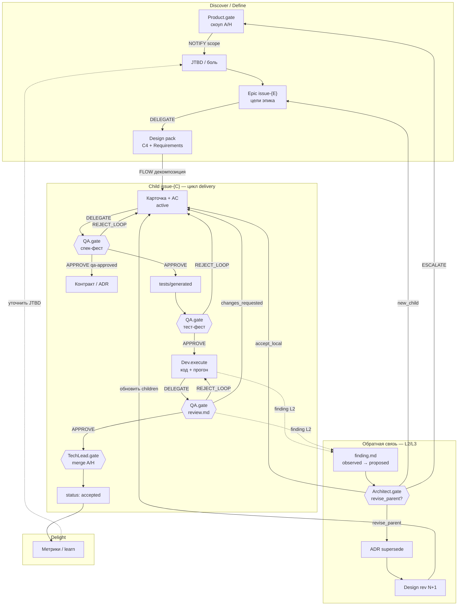
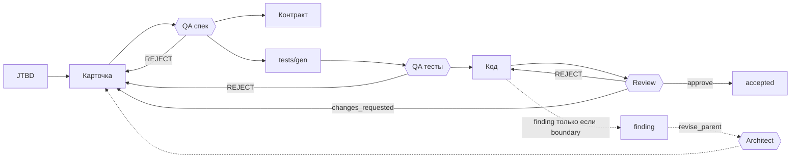
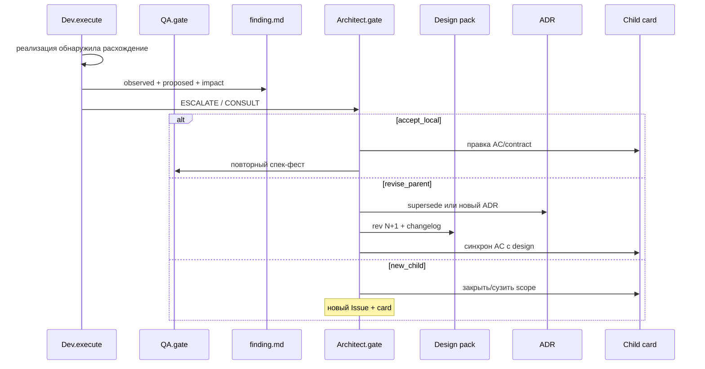

# SDD: tier'ы сложности, обратная связь и граф артефактов

Дополнение к [SDD_WORKFLOW.md](./SDD_WORKFLOW.md). Продуктовые RACI-спеки репозитория (если есть) остаются вне кита.
Шаблоны: [docs/_templates/](_templates/).

**Проблема:** карточка + AC хороши для одной фичи; высокоуровневый план и C4 не будут точны на 100%. Нужен **явный канал** «реализация → документы», не тихий rewrite.

---

## Requirement 1 — Tier'ы сложности задач

**User Story:** Как техлид, я хочу разный объём артефактов для S/M/L задач, чтобы мелкие фиксы не тащили C4, а эпики не сжимались в одну карточку.

#### Acceptance Criteria

1. WHEN задача tier **S** (баг, точечный фикс) THEN достаточно карточки `issue-{N}.md` с AC
2. WHEN задача tier **M** (фича, 1–2 PR) THEN SHALL быть JTBD (опционально) + карточка + контракт/ADR по необходимости + tests
3. WHEN задача tier **L** (эпик, платформа, несколько PR) THEN SHALL быть epic/design pack + **дерево** child-карточек (`parent: issue-{N}`)
4. WHEN child issue закрыт THEN гейты ролей (Analyst/QA/Dev/Architect/TechLead) SHALL применяться **к каждому child**, не ко всему эпику одним RUN
5. IF верхний design уже `approved` THEN изменение SHALL идти через finding + гейт Architect A/H, не молча

| Tier | Пример | Артефакты |
|------|--------|-----------|
| **S** | typo, hotfix | `card-ac` |
| **M** | фильтры в UI, один API | `jtbd?` → `card-ac` → `contract?` → tests → review |
| **L** | SM + DSL, платформа MAS | `epic` → `design-c4` → child `card-ac` × N → integration gate |

---

## Requirement 2 — Обратная связь от реализации к документам

**User Story:** Как разработчик/архитектор, я хочу формализованный сигнал «в коде оказалось иначе», чтобы пересмотреть child, design или ADR без нарушения SoT.

#### Acceptance Criteria

1. WHEN расхождение **локальное** (уточнение AC child) THEN SHALL правка child-карточки + связанных contract/tests в том же issue
2. WHEN расхождение **граничное** (меняется контейнер, sibling, scope) THEN Dev/Architect SHALL создать `issue-{N}.findings.md` с verdict pending
3. WHEN verdict `revise_parent` THEN Architect A/H SHALL обновить design/epic с changelog (`rev 2`) и при необходимости ADR `supersedes`
4. WHEN verdict `new_child` THEN Product/Architect SHALL завести новый Issue + child-карточку, не раздувая текущую
5. IF меняется `tests/approved` THEN это SHALL быть **связанная транзакция** со спекой/контрактом
6. WHEN агент обнаружил расхождение THEN он SHALL **не** переписывать epic/design сам — только finding + ESCALATE

#### Классы расхождений

| Класс | Пример | Куда сигнал |
|-------|--------|-------------|
| **Detail** | поле JSON, уточнение AC | child card |
| **Boundary** | CLI ≠ Create агента | design + ADR |
| **Invalidated premise** | reuse vs write-new | ADR supersede + design rev |
| **Scope creep** | всплыл Deploy | Product A/H, новый child |

---

## Design — граф артефактов между нодами (ролями)

Ноды = **роли/агенты** из RACI. Рёбра = **передача артефакта** или **сигнал** (REJECT, finding, NOTIFY). Циклы — норма, не сбой.

### Полный граф: tier L (эпик) + обратная связь

### Граф tier M (одна фича) — без epic, с локальными циклами

### Типы рёбер (передача между нодами)

| Ребро | Артефакт / сигнал | Блокирует? | Пример |
|-------|-------------------|------------|--------|
| **DELEGATE** | карточка, код, review | Да | Analyst → QA.gate |
| **APPROVE** | статус `qa-approved` | — | QA → Develop |
| **REJECT_LOOP** | замечания + cycle_count | Да (цикл) | QA → Analyst, max 3 |
| **ESCALATE** | reason, escalated_to | Да | → TechLead.gate / Product |
| **CONSULT** | read-only контекст | Нет | Dev → Architect |
| **NOTIFY** | статус, метрика | Нет | QA → Product |
| **FINDING** | finding.md | Да до verdict | Dev → Architect.gate |
| **REVISE** | design rev, ADR supersede | Да | Architect → Design → children |
| **FLOW** | guard по статусу артефакта | Да | tests_approved → code |

### Sequence: finding поднимается наверх

---

## Карта артефактов (расширение)

| Артефакт | Путь | Шаблон | Когда |
|----------|------|--------|-------|
| Epic | `docs/requirements/cards/issue-{E}.md` + `kind: epic` | [epic.md](_templates/epic.md) | tier L |
| Design / C4 | `docs/design/issue-{E}.md` | [design-c4.md](_templates/design-c4.md) | tier L, до children |
| Finding | `docs/requirements/review/issue-{C}.findings.md` | [finding.md](_templates/finding.md) | L2/L3 из Develop |
| Child card | `docs/requirements/.../issue-{C}.md` | [card-ac.md](_templates/card-ac.md) + `parent` | tier L leaf |

Пример design pack для платформы: [plans/01_state_machine_dsl.md](./plans/01_state_machine_dsl.md) (можно копировать в `docs/design/` после approve эпика).

---

## Подзадачи (внедрение методики)

- [ ] Шаблоны `epic`, `design-c4`, `finding` в `_templates/` — **готово в этом PR docs**
- [ ] Поле `tier`, `parent`, `design_ref` в card-ac — **готово**
- [ ] Ссылка из raci-agents-7d §5.3 и SDD_WORKFLOW — **готово**
- [ ] Issue template «Epic» на GitHub — позже
- [ ] Skill агента: «не revise_parent без Architect» — позже

---

## Связанные документы

- [raci-agents-7d.md](./raci-agents-7d.md) §4 — компиляция RACI → граф агентов
- [SDD_WORKFLOW.md](./SDD_WORKFLOW.md) — операционный процесс
- [plans/](./plans/) — примеры tier L design packs
